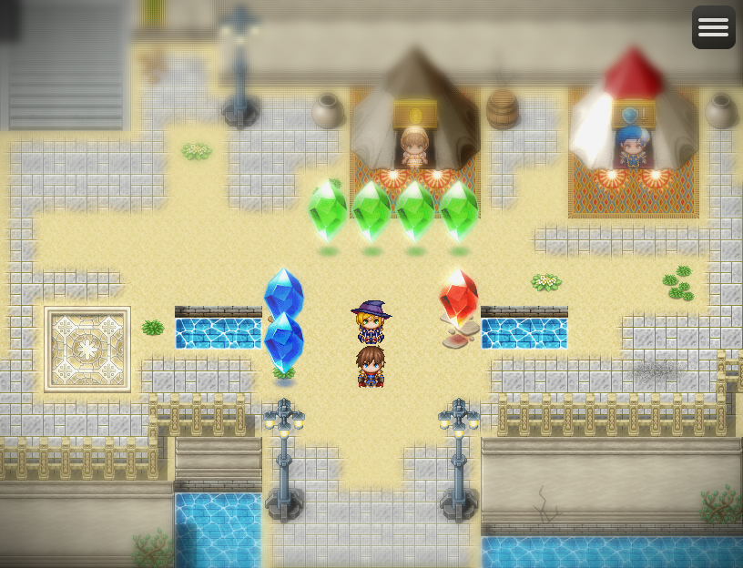
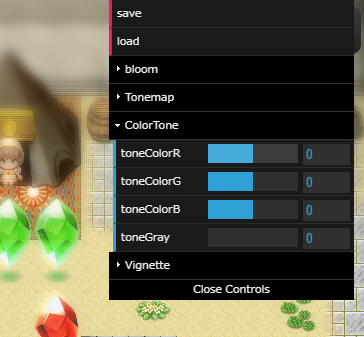
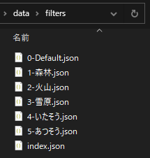
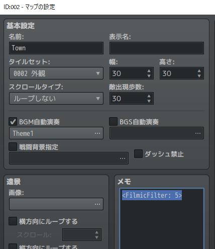
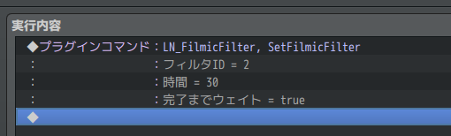
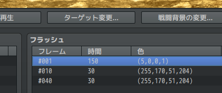
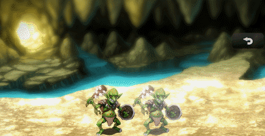

FilmicFilter
==========

グラフィックスをより豊かに見せるための撮影効果を付加するプラグインです。

**ダウンロード**

| Version | File |
|---------|------|
| v1.0.0  | [:arrow_down: LN_FilmicFilter.js](https://raw.githubusercontent.com/lriki/LN_FilmicFilter/master/js/plugins/LN_FilmicFilter.js) |

サンプルプロジェクト
----------

RPGツクールMZ でプロジェクトを新規作成した後、次のファイルをダウンロードして含まれているファイルをすべて上書きしてください。

[:arrow_down: サンプルプロジェクト](https://github.com/lriki/LN_FilmicFilter/archive/refs/heads/main.zip)

使い方
----------

プラグインを有効にすると、デフォルトで次のようなティルトシフトとビネットフィルタがかかります。

### フィルタ設定を作る

テストプレイ中に `F11` キーを押すと、次のようなエディタが表示されます。
マウスでバーをドラッグすることで、値を編集できます。

値を決めたら、[Save] をクリックするとフィルタ設定ファイル(.json)を保存できます。
ファイルは `<プロジェクトフォルダ>/data/filters` フォルダ内に `数値-名前.json` という名前で保存してください。
この `数値` は、イベントなどからフィルタ設定を読み込むときに使う `フィルタID` となります。

### マップにフィルタを設定する

マップ設定の [メモ] 欄に `<FilmicFilter: フィルタID>` と記入すると、そのマップに遷移したときに指定した ID のフィルタを適用します。

記入しない場合、デフォルトの設定が使われます。`-1` を指定すると、フィルタを適用しません。

### イベントでフィルタを変更する

プラグインコマンドの `SetFilmicFilter` を使うと、画面の色調変更と同じようにフィルタを適用できます。

### アニメーションのフラッシュとしてフィルタを適用する

`強さ` が `1` のフラッシュを作ると、`赤` の値を フィルタID とみなしてフィルタを適用できます。

