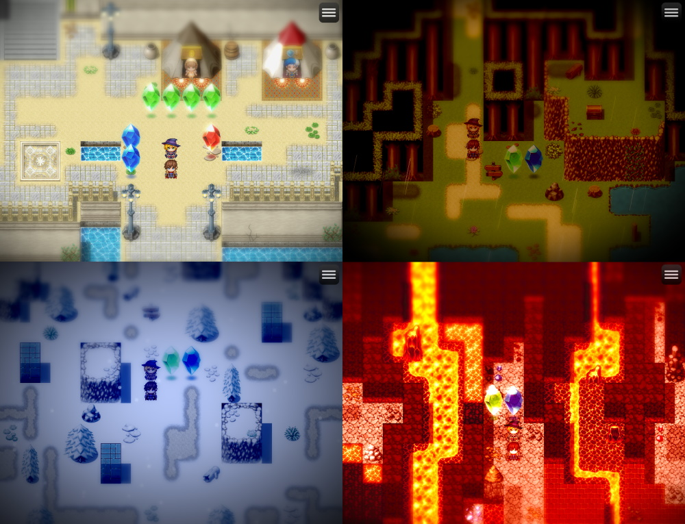
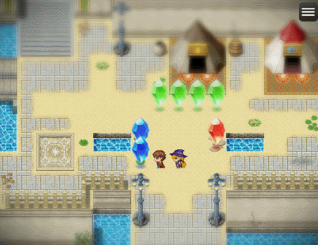

RPGツクールMZ用 ジオラマ風の撮影効果プラグイン
==========

グラフィックスを豊かに見せるための撮影効果を追加するプラグインです。

**ダウンロード**

| Version | File |
|---------|------|
| v1.1.0  | [:arrow_down: LN_FilmicFilter.js](https://raw.githubusercontent.com/lriki/LN_FilmicFilter/master/js/plugins/LN_FilmicFilter.js) |

> ⚠ コアスクリプトは最新バージョンにしてください。少なくとも v1.0.0 では正しく表示できないことがあります。このプラグインは v1.2.1 で動作確認を行っています。

サンプルプロジェクト
----------

RPGツクールMZ でプロジェクトを新規作成した後、次のファイルをダウンロードして含まれているファイルをすべて上書きしてください。

[:arrow_down: サンプルプロジェクト](https://github.com/lriki/LN_FilmicFilter/archive/refs/heads/main.zip)

使い方
----------

プラグインを有効にすると、デフォルトで次のようなティルトシフトとビネットフィルタがかかります。

### フィルタ設定を作る

テストプレイ中に `F11` キーを押すと、次のようなエディタが表示されます。
マウスでバーをドラッグすることで値を編集できます。

[Save] をクリックすると、編集中の値をフィルタ設定ファイル(.json)を保存できます。
ファイルは `<プロジェクトフォルダ>/data/filters` フォルダ内に `数値-名前.json` という名前で保存してください。
この `数値` は、イベントなどからフィルタ設定を読み込むときに使う `フィルタID` となります。

### マップにフィルタを設定する

マップ設定の [メモ] 欄に `<FilmicFilter: フィルタID>` と記入すると、そのマップに遷移したときに指定した ID のフィルタを適用します。

記入しない場合、デフォルトの設定が使われます。`-1` を指定すると、フィルタを適用しません。

### イベントでフィルタを変更する

プラグインコマンドの `SetFilmicFilter` を使うと、画面の色調変更と同じようにフィルタを適用できます。

### アニメーションのフラッシュとしてフィルタを適用する

`強さ` が `1` のフラッシュを作ると、`赤` の値を フィルタID とみなしてフィルタを適用できます。

注意点
----------

のプラグインは一部、UnrealEngine のようなハイエンド向けゲームエンジンと似た仕組みで作られています。そのため現バージョンではややマシンスペックを要求するかもしれません。

不具合報告の際は次のような、問題が発生している環境の情報を併記いただけると助かります。

* マシンの情報 (OS, CPU, RAM, GPU 等)
* 実行環境 (デスクトップ, Web 等)

既知の不具合や要望は [こちらのページ](https://github.com/lriki/LN_FilmicFilter/issues) を参照してください。

